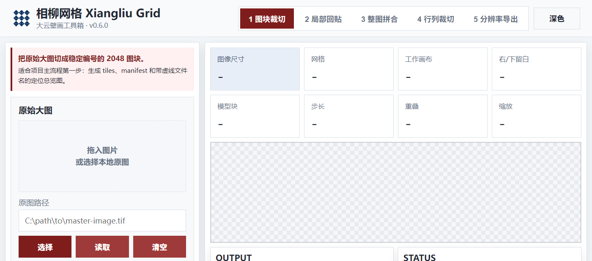
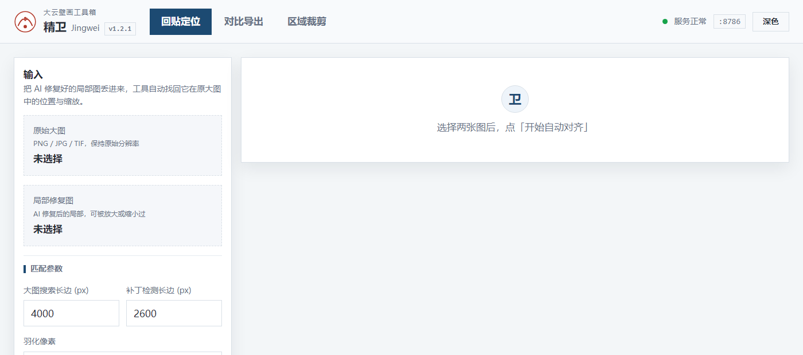
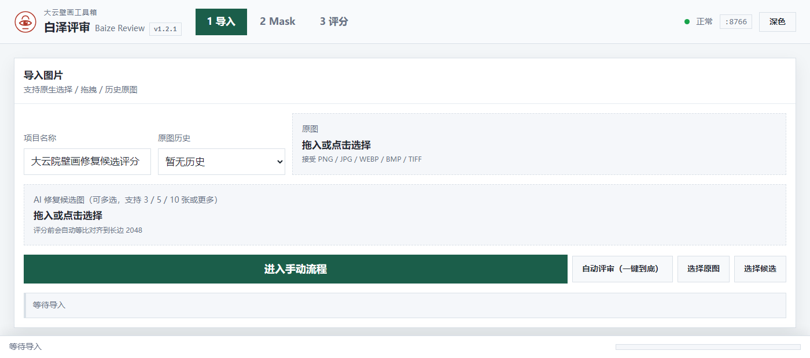

# 上官文卿 · SGWinking

给壁画做修复的人，顺手给自己造了一套工具。

---

## 大云壁画工具箱 · Dayun Mural Toolkit


一张两万像素宽的壁画扫描图，要经过 **切块分片 → 逐块修复 → 找回原位贴回 → 候选评分 → 差异复核**。
每一步都不该塞进一个巨型软件里，所以每一步一个小工具 —— 五个仓库，一套视觉，各自一个颜色。

**全部在本机运行。** 不联网、不上传、不要账号、不埋点。双击 `run.bat` 就能用。

### 五个仓库

| # | 工具 | 干什么 | 端口 | 技术栈 |
|:-:|---|---|:-:|---|
| ① | **[相柳网格](https://github.com/SGWinking/xiangliu-grid)**<br>`xiangliu-grid` | 把超大扫描图切成带编号的方图块；修复后按原位拼回，并做接缝平衡与低频颜色校正 | 8765 | Python |
| ② | **[精卫](https://github.com/SGWinking/jingwei-patch)**<br>`jingwei-patch` | 把 AI 修复好的局部图**自动找回**它在原大图中的位置与缩放，贴回原位 | 8786 | Python · OpenCV |
| ③ | **[白泽评审](https://github.com/SGWinking/baize-review)**<br>`baize-review` | 同一个位置有好几份 AI 候选？打分排名，输出保守修复榜与展示复原榜 | 8766 | Python |
| ④ | **[重明 DiffEye](https://github.com/SGWinking/chongming-diffeye)**<br>`chongming-diffeye` | 比对两张图的线条、轮廓、纹样与像素差异，标出新增 / 缺失 / 偏移 | 5055 | Node · Python |
| ⑤ | **[工具箱启动台](https://github.com/SGWinking/dayun-mural-toolkit)**<br>`dayun-mural-toolkit` | 一页看清五个工具装没装、跑没跑、什么版本，一键启动 | 8700 | Python 标准库 |

### 一条完整的工作流

```text
                      一张超大壁画扫描图
                             │
        ① 相柳网格 ──────────┴──►  切成 N 块带编号的方图块
                                    （并建立校色基线）
                             │
                             ▼
              ┌──── 把每一块交给 AI / 人工修复 ────┐
                             │
        ② 精卫 ──────────────┴──►  修好的局部图自动找回原位，贴回大图
                             │
        ③ 白泽评审 ──────────┴──►  同一位置的多份候选，打分排名
                             │
        ④ 重明 ──────────────┴──►  修复前后对比，标出哪里变了、变了多少
                             │
        ⑤ 启动台 ────────────┴──►  忘了谁在哪个端口？看这里
```

---

## 每个工具长什么样

### ① 相柳网格 · Xiangliu Grid



把母版严格切成带编号的方形图块，修复后按原始网格位置局部或完整拼合。
v0.4 起内置**接缝平衡**与**低频颜色场校正**，让几十块独立修复的图块拼回后看不出色块边界。

[源码](https://github.com/SGWinking/xiangliu-grid) · `v0.6.0` · MIT

### ② 精卫 · Jingwei



AI 把一块局部图修好了，但它相对原图可能被缩放、裁切、轻微旋转过 —— 手工对位极其痛苦。
精卫用 SIFT 特征匹配自动算出位置与比例（实测同源图位置偏差为 0），再贴回原位，输出同尺寸对比图。

[源码](https://github.com/SGWinking/jingwei-patch) · `v1.2.1` · MIT

### ③ 白泽评审 · Baize Review



同一处损伤，跑了五种模型、五种参数，出了二十张候选 —— 挑哪张？靠眼睛看二十遍不现实。
白泽自动生成 evidence mask 与损伤指标，输出**保守修复榜**（宁可不修，不能改错）和**展示复原榜**两套排名。

[源码](https://github.com/SGWinking/baize-review) · `v1.2.1` · MIT

### ④ 重明 DiffEye


"修好了"这件事需要被验证。重明比对两张图的线条与纹样结构差异，用黄框圈出每一处变化区域，
区分**新增 / 缺失 / 偏移**三种类型，并给出聚焦区域清单。
可选 DexiNed 精细线条模式，复杂纹样下识别更准。

[源码](https://github.com/SGWinking/chongming-diffeye) · `v1.2.0` · MIT

---

## 为什么叫这些名字

都出自同一个体系 —— 每个名字都在说它干的活：

| 名字 | 出处 | 为什么 |
|---|---|---|
| **相柳** | 山海经 · 九首 | 一头多身 → 一张大图分成很多块 |
| **精卫** | 神话 · 衔石填海 | 一块一块衔回来填上 → 逐块补回原位 |
| **白泽** | 山海经 · 知万物 | 能辨万物优劣 → 辨识哪张候选更好 |
| **重明** | 神话 · 重明鸟 | 双瞳，明察秋毫 → 看见最细微的差异 |
| **大云** | 大云禅院 | 这套工具服务的对象 |

仓库名统一是 `<拼音>-<英文职能词>`（`xiangliu-grid`、`jingwei-patch`…）：
只写拼音，不懂中文的人看不出这是干什么的；只写英文，又丢掉了整套神话体系。

---

## 这是一套，不是五个

五个仓库共用同一份[系列规范](https://github.com/SGWinking/dayun-mural-toolkit)：

- **同一套骨架 token** —— 底色、面板、字号、圆角、阴影全系列一致；每个工具**只换 5 个 accent 值**。
  颜色取敦煌矿物颜料：朱砂红 / 石青蓝 / 石绿 / 琥珀金。
- **同一个入口** —— 一律 `run.bat` + `run.ps1`，双击即用，自带依赖检查与中文错误提示。
- **同一条安全底线** —— 只监听 `127.0.0.1`，静态与输出文件走真路径校验（不用字符串前缀判断），
  上传体积与参数全都有上限，错误响应结构统一。
- **同一份工程纪律** —— 版本号四处一致、编码检查脚本、发布前体检脚本。
  连"PowerShell 5.1 会把无 BOM 的 UTF-8 中文脚本按 GBK 读"这种坑都有专门的检查器兜着。

界面底色一律是冷灰蓝而不是纯白，浅色元素一律有实底而不是"透明压白"，
主按钮与次级按钮必须一眼可分，直角、细边线、靠阴影做层级。

---

## English

**Dayun Mural Toolkit** — a set of local-first tools for restoring large Dunhuang mural scans.

One enormous scan goes through: **tile it → restore each tile → find its place back → rank the candidates → verify the difference.**
Each step is a small tool of its own. Five repositories, one visual language, each with its own colour.

Everything runs **entirely on your machine** — no network, no upload, no account, no telemetry. Double-click `run.bat`.

| # | Tool | Role |
|:-:|---|---|
| ① | [xiangliu-grid](https://github.com/SGWinking/xiangliu-grid) | Tile a huge scan into numbered blocks, stitch them back, balance seams and low-frequency colour |
| ② | [jingwei-patch](https://github.com/SGWinking/jingwei-patch) | Locate a restored patch inside the original scan (SIFT) and paste it back in place |
| ③ | [baize-review](https://github.com/SGWinking/baize-review) | Score and rank AI restoration candidates — a conservative board and a presentation board |
| ④ | [chongming-diffeye](https://github.com/SGWinking/chongming-diffeye) | Structural and pixel diff: linework, contours, patterns — new / missing / shifted regions |
| ⑤ | [dayun-mural-toolkit](https://github.com/SGWinking/dayun-mural-toolkit) | The launcher: see what is installed, what is running, start it with one click |

Named after figures from the *Classic of Mountains and Seas* — Xiangliu (one body, many heads → one image, many tiles),
Jingwei (carrying stones to fill the sea → patching block by block), Baize (knows all things → judging which candidate is better),
Chongming (double pupils, sees the smallest difference → verifying the restoration).

---

## 协议

源代码全部使用 [MIT License](https://github.com/SGWinking/xiangliu-grid/blob/main/LICENSE)。
「大云壁画工具箱」「相柳网格」「精卫」「白泽评审」「重明 DiffEye」的名称、logo 与视觉识别
保留为作者品牌资产，不随 MIT 协议授予商标或品牌使用权。

<sub>中文名 / 品牌：上官文卿 · SGWinking</sub>
