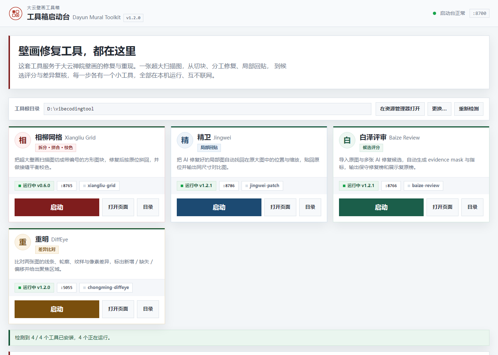

# 上官文卿

建筑师，也做 AIGC。

建筑方案是主业，AIGC 是我现在做设计研究和视觉表达的主要手段。这两件事做久了，手边会攒下一堆小工具。图太大塞不进模型，改完几十版没法用人眼比，模型输出的局部还得手工找回原位——每次都靠磨，不如写个东西替我磨。

这个账号上放的就是这类工具。

---

## 大云壁画工具箱

最近接的一个活：一批寺庙壁画的扫描图要修复。

一张扫描图两万像素宽。整张丢给模型不行，人眼一块一块比对也不行。所以按实际流程拆成四个工具，各管一步。

| 顺序 | 工具 | 管哪一步 |
|:-:|---|---|
| 1 | [相柳网格](https://github.com/SGWinking/xiangliu-grid) | 把大图切成带编号的方图块，修完按原位拼回去，接缝处做颜色校正 |
| 2 | [白泽评审](https://github.com/SGWinking/baize-review) | 每一块都会产出很多版候选，人眼比不过来，交给它打分排名 |
| 3 | [重明比对](https://github.com/SGWinking/chongming-diffeye) | 从排名里挑出几张，再逐张比对，圈出哪里多了、少了、挪了 |
| 4 | [精卫回贴](https://github.com/SGWinking/jingwei-patch) | 个别局部还得重修（比如切块时正好把人切成两半），修完自动找回原位贴回 |

四个工具都由[工具箱启动台](https://github.com/SGWinking/dayun-mural-toolkit)统管：看谁装了、谁在跑、什么版本，一键打开。

名字是从《山海经》和神话里挑的：相柳有九个头，精卫衔石子填海，白泽认得天下万物，重明鸟一只眼睛两个瞳仁。都跟工具干的活对得上。

切完块之后，图会分发出去由不同的模型或人来修。回来的成堆候选先由白泽筛一遍，挑出几张再用重明细看，最后才轮到精卫——它是补救手段，不是第二步。

四个工具和启动台共用一套配色与控件，双击 `run.bat` 启动。服务只监听本机 127.0.0.1，不发网络请求。仓库里也没有运行时、模型权重和比对产物，克隆下来跑 `install.bat` 装依赖就行。

上面这张是重明刚打开的样子：左边两张图，中间参数，右边出结果。四个工具的 README 里都写了各自的输出文件长什么样。

代码用 MIT 协议发布。工具的中文名、logo 和视觉识别不随协议授予。

---

## Dayun Mural Toolkit

I'm an architect, and I use generative models as a working tool. Most of what's on this account is plumbing I wrote for my own projects.

The current one is a batch of temple mural scans. A single scan is twenty thousand pixels wide — too big to hand to a model whole, too tedious to check block by block by eye. So the workflow got split into five small local tools: tile the image and stitch it back with seam colour correction, relocate a restored patch inside the original, rank competing AI candidates, and diff before and after to see what was added, lost or shifted. A launcher keeps track of which one is running on which port.

Everything runs on your machine. No network calls, no account. MIT licensed.
